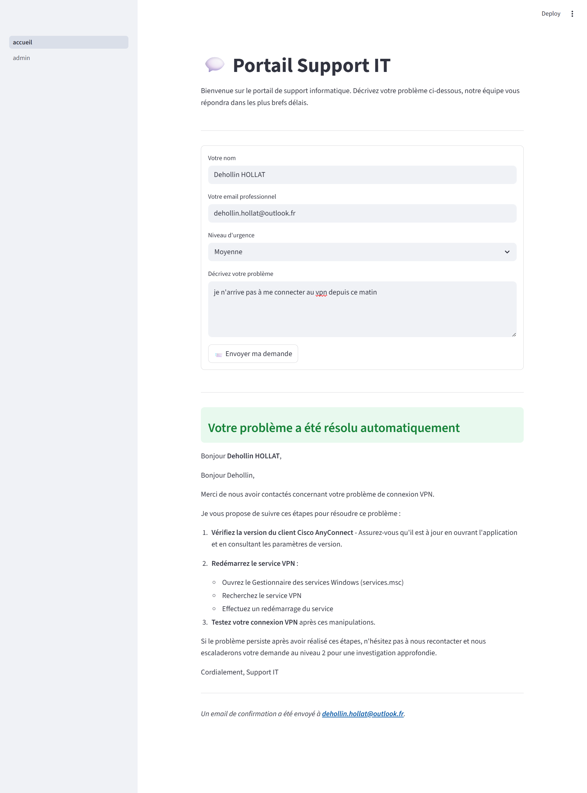
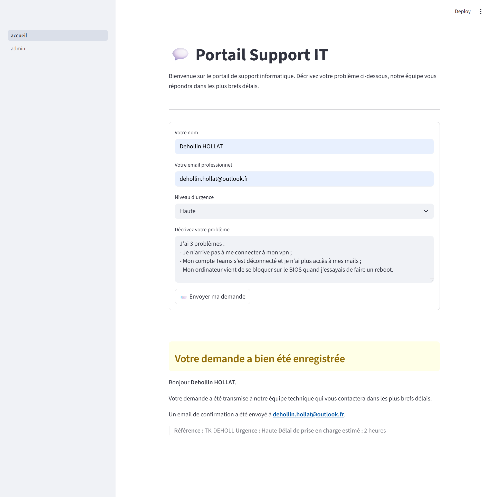
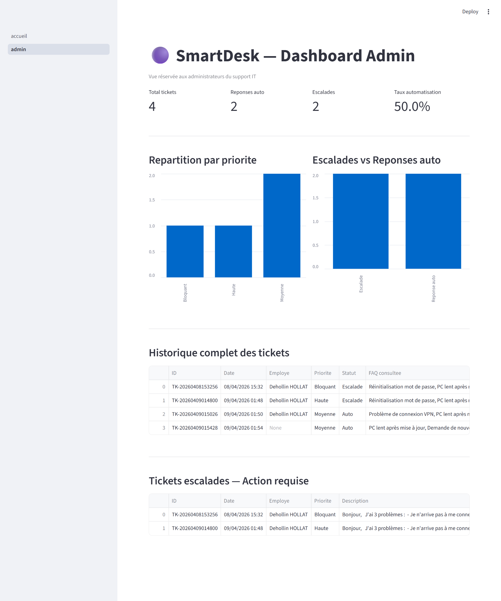

# 🟣 SmartDesk — Agent IA de Support IT avec RAG et Escalade Automatique

> Projet personnel réalisé dans le cadre d'une formation MBA Big Data & IA
> pour développer des compétences concrètes en IA générative et développement API.
---

## 📌 Problématique
Dans les ESN et entreprises, le support IT interne traite chaque semaine des
centaines de tickets. Une grande partie concerne des problèmes récurrents et
bien documentés : réinitialisation de mot de passe, problème VPN, installation
de logiciel.
SmartDesk automatise ce cycle en déployant un agent IA capable de :
- **Lire et comprendre** le ticket de l'employé
- **Consulter la base de connaissances** IT via une recherche sémantique (RAG)
- **Répondre automatiquement** aux cas simples avec une réponse personnalisée
- **Escalader intelligemment** les cas complexes à un agent humain

**🎯 Résultat : traitement automatique des tickets simples, escalade justifiée
des cas complexes — exposé via une API REST consommable.**

---
## 🧠 Concepts clés
| Concept | Application dans SmartDesk |
|---|---|
| **RAG** (Retrieval-Augmented Generation) | L'agent consulte la FAQ IT avant de répondre |
| **Agent IA** | Décision autonome : répondre ou escalader |
| **API REST** | Endpoint POST /ticket consommable par n'importe quel système |

---
## ⚙️ Architecture
```
[Ticket entrant via POST /ticket]
        ↓
[Recherche sémantique dans ChromaDB]
        ↓
[API Claude — analyse ticket + FAQ]
        ↓
      /     \
  Simple   Complexe
    ↓          ↓
RÉPONSE     ESCALADE
  AUTO       NIVEAU 2
```

---
## 🖥️ Dashboard Streamlit

SmartDesk embarque un dashboard Streamlit avec deux vues distinctes.

### Exemple de réponse automatique — Vue Employé

L'employé soumet son ticket via un formulaire simple. L'agent répond automatiquement aux cas simples sans que l'employé sache qu'une IA traite sa demande.



---

### Exemple d'escalade automatique

Pour les cas complexes, l'agent escalade automatiquement vers un technicien niveau 2.



---

### Dashboard Admin — Supervision et KPIs

Interface dédiée aux administrateurs : KPIs en temps réel, historique complet des tickets, liste des escalades et graphiques de suivi.



---
## 🖥️ Démo — Swagger UI
L'API expose une documentation interactive auto-générée par FastAPI.

### Exemple de ticket simple — Réponse automatique
**Requête :**
```json
{
  "employe": "Marc Dupont",
  "description": "Mon mot de passe a expiré, je ne peux plus accéder à ma messagerie.",
  "priorite": "Haute"
}
```
**Réponse :**
```json
{
  "employe": "Marc Dupont",
  "escalade": false,
  "reponse": "RÉPONSE_AUTO: Bonjour Marc, pour réinitialiser votre mot de passe, rendez-vous sur le portail IT > Mot de passe oublié...",
  "faq_consultee": ["Réinitialisation mot de passe"]
}
```

### Exemple de ticket complexe — Escalade automatique
**Requête :**
```json
{
  "employe": "Lucas Martin",
  "description": "Écran bleu au démarrage, impossible de démarrer Windows.",
  "priorite": "Bloquant"
}
```
**Réponse :**
```json
{
  "employe": "Lucas Martin",
  "escalade": true,
  "reponse": "ESCALADE: Intervention physique requise. Technicien niveau 2 dépêché sous 2h.",
  "faq_consultee": ["Écran bleu Windows BSOD"]
}
```

---
## 🚀 Installation & Lancement
```bash
# 1. Cloner le repo
git clone https://github.com/ton-profil/smartdesk.git
cd smartdesk
# 2. Installer les dépendances
pip install -r requirements.txt
# 3. Créer le fichier .env
echo "ANTHROPIC_API_KEY=ta-clé-api" > .env
# 4. Indexer la FAQ dans ChromaDB
python src/rag.py
# 5. Lancer l'API
python -m uvicorn src.main:app --reload
# 6. Ouvrir la documentation Swagger
# http://127.0.0.1:8000/docs
# 7. Lancer le dashboard Streamlit
streamlit run src/Accueil.py
```

---
## 🛠️ Stack technique
| Outil | Rôle |
|---|---|
| Python | Langage principal |
| API Claude (Anthropic) | Génération des réponses et décision d'escalade |
| ChromaDB | Base vectorielle pour la recherche sémantique (RAG) |
| FastAPI | Exposition de l'agent via une API REST |
| Streamlit | Dashboard employé et admin |
| Uvicorn | Serveur ASGI pour FastAPI |
| python-dotenv | Gestion sécurisée de la clé API |

---
## 📂 Structure du repo
```
smartdesk/
├── data/
│   ├── faq_it.json
│   └── tickets_log.json
├── docs/
│   ├── Dashboard_admin.png
│   ├── Exemple_réponse_automatique.png
│   └── Exemple_escalade.png
├── src/
│   ├── pages/
│   │   └── Admin.py
│   ├── accueil.py
│   ├── agent.py
│   ├── main.py
│   └── rag.py
├── .gitignore
├── README.md
└── requirements.txt
```

---
## 💡 Améliorations possibles
- Ajout d'un historique de conversation (mémoire multi-tours)
- Connexion à un vrai système de ticketing (Jira, ServiceNow)
- Déploiement sur Railway ou Render

---
## 👤 Auteur
**Déhollin HOLLAT** — Chef de Projet Data IA  
Formation MBA Big Data & IA
**Dehollin.hollat@outlook.fr**
